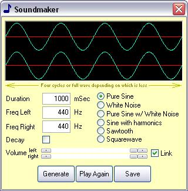



## Soundmaker

### Description

This little gadget creates, plays and optionally saves .wav files. You define duration, frequency and sound characteristics. Update vor visualisation. See screenshot for details. Download ist only 7 kB.
 
### More Info
 

             |
---                |---
**Submitted On**   |2006-03-30 00:15:30
**By**             |[ULLI](https://github.com/Planet-Source-Code/PSCIndex/blob/master/ByAuthor/ulli.md)
**Level**          |Intermediate
**User Rating**    |4.9 (34 globes from 7 users)
**Compatibility**  |VB 6\.0
**Category**       |[Sound/MP3](https://github.com/Planet-Source-Code/PSCIndex/blob/master/ByCategory/sound-mp3__1-45.md)
**World**          |[Visual Basic](https://github.com/Planet-Source-Code/PSCIndex/blob/master/ByWorld/visual-basic.md)
**Archive File**   |[Soundmaker1984023302006\.zip](https://github.com/Planet-Source-Code/ulli-soundmaker__1-64845/archive/master.zip)

